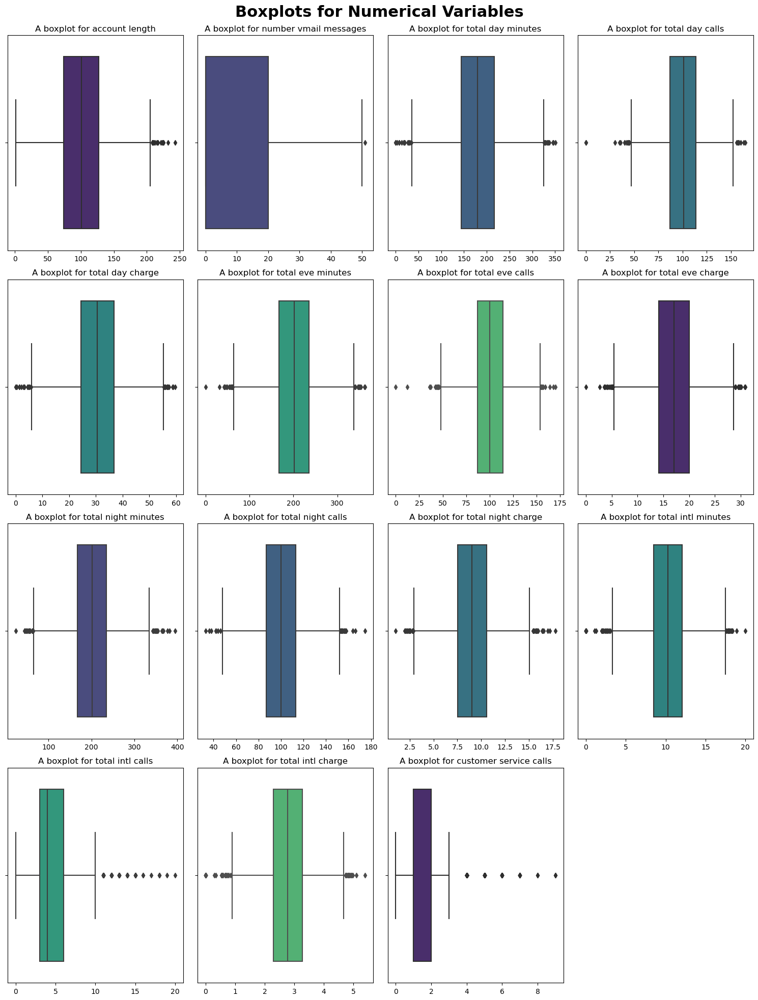
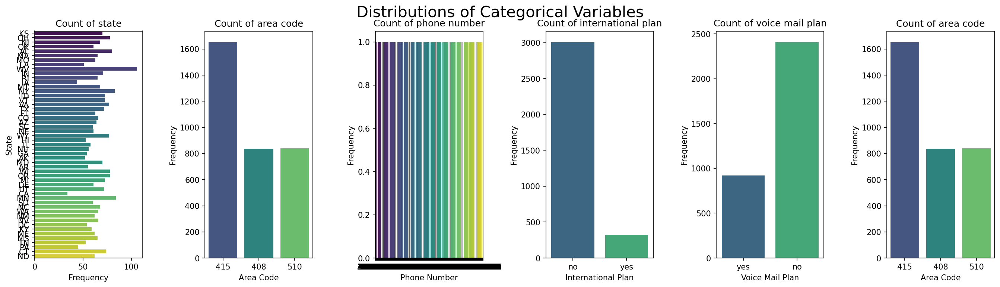
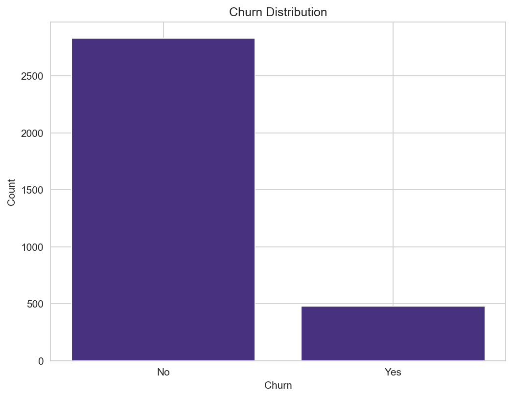

# README.

## SYRIATEL CUSTOMER CHURN.

1. Project Overview / Background

2. Stakeholder

3. Problem Statement

4. Objectives

5. Business Understanding

6. Data Understanding

7. Modeling

8. Conclusion

9. Recommendations

### Project overview / Background.
SyriaTel prides itself in provision of a wide range of services, including mobile, landline, and internet connectivity, to its customers. However, the company faces the menace of customer churn which is a problem that is witnessed across several other telecommunication companies.

The communication technology industry is one of the most competitive industries nowadays. The main problem that practically all telecommunications industries worldwide are currently facing is customer churn.Churn, in the context of telecommunications, is the process by which customers leave a business and stop using the services it provides either because they are unhappy with those services or because they can find better options from other network providers at more reasonable prices. This could result in a loss of revenue or profit for the business. Additionally, keeping clients has grown to be a challenging task.

In order to provide their clients with the best services possible and keep them satisfied, businesses are working hard to introduce new cutting-edge applications and technology.Since losing them would result in a large loss of revenue for the business, it is imperative to identify those clients who are likely to quit the organization in the near future in advance. Accurately predicing churn can lead to higher customer retention rates, increased market share and improved business performance.This project seeks to accomplish this procedure, which is known as churn prediction. We tried to detect whether there is a noticeable pattern for this, study the customer behavior and key factors that influences churn.

### Stakeholders.
Stakeholders for this project are the Customer Retention Team and Potential Investors and Partners.

### Problem statement.
In a fiercely competitive market, SyriaTel telecommunications company aims to enhance customer retention strategies to stabilize its market position. With the considerable expense of acquiring new customers and the financial impact of customer churn, SyriaTel seeks to implement effective measures to retain existing customers and mitigate losses. This project will explore strategies to improve customer retention, thereby ensuring sustainable growth and competitiveness in the telecommunications industry.

### Objectives.
- Main objective:
To predict customer churn using a machine learning classification algorithm model

- Specific objectives:
To do exploratory data analysis on the dataset
To fit different classification algorithm models to determine which one works best for churn prediction
To select the best model
To make predictions using the selected model
To check the accuracy of the predicted variables

### Business Understanding.
SyriaTel, a telecommunications company, is experiencing severe churn, with many consumers abandoning its services and migrating to competitors. The company intends to address this issue by creating a churn prediction model. SyriaTel hopes to obtain insights into churn-related factors through analyzing the dataset, with the goal of lowering churn, increasing customer retention, and enhancing overall profitability.

### Data understanding.
This data is from syriatel telecommunication company and it was obtained from kaggle Churn in Telecom's dataset, https://www.kaggle.com/datasets/becksddf/churn-in-telecoms-dataset .

The data has 21 columns and 3333 rows. The target column, churn, is a bool column where True means the customer did churn and False means the customer did not churn, making this a binary classification problem. The other columns were; 6 categorical and 15 numerical columns.

### Modeling

This is a distribution of our numerical variables in the dataset.

This is a distribution of our categorical variables in the dataset.

This bar graph shows that most of the customers are sticking with Syria Tel company while a few of the customers are getting churned.

### Conclusion

-  Contributors of High Customer Churn are: 
    - Customers who have an international plan
    - High number of international minutes
    - High number of day minutes
    - High number of night minutes
    - High number of customer service calls

- Customers with international plans churn more compared to customers without international plans. This maybe as a result of high rates of international calling charges.
- Certain states exhibited a higher churn rate than others, potentially attributed to coverage issues.
- The dataset suggests that area codes and account length don't seem to have that much influence on the churn rate. This makes these columns somewhat unnecessary or redundant in the dataset.
- In the dataset, it was evident that SyriaTel charged customers based on their minutes of usage. However, high customer churn seemed to be driven by factors leading to increased bills, discouraging customers from continuing their phone plans.
- The model achieves a fine balance between precision and recall, effectively identifying positive class instances while keeping false positives and false negatives low. With an accuracy of 94%, it's well-suited for predicting churn.

### Recommendations

- One of the most significant predictors of churn was the amount of customer service calls. This shows that offering good customer service and responding to customer problems quickly and efficiently can help to prevent churn. Focus on educating customer care staff to handle customer concerns efficiently and give proactive support to increase client satisfaction and loyalty.
- Focus on customer retention strategies in states with higher churn rates.
- Given its importance in predicting churn, it would be beneficial to review the structure and pricing of the international plan to ensure it meets customer needs.
- Customers with a higher total charge are more likely to churn. A review of pricing strategies and structures could help to ensure they are competitive and provide value to customers. Evaluate the pricing structure for day, evening, night, and international charges.
- Enhance the value proposition of the voicemail plan to increase adoption among customers.